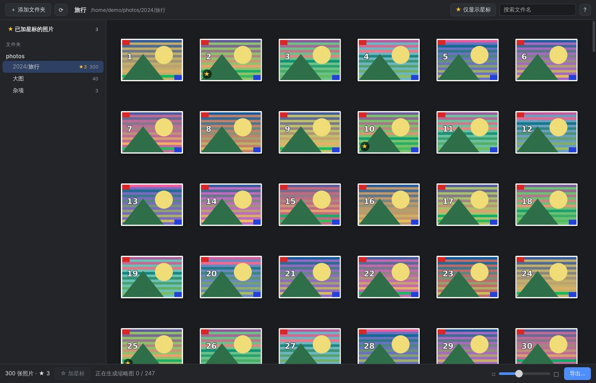
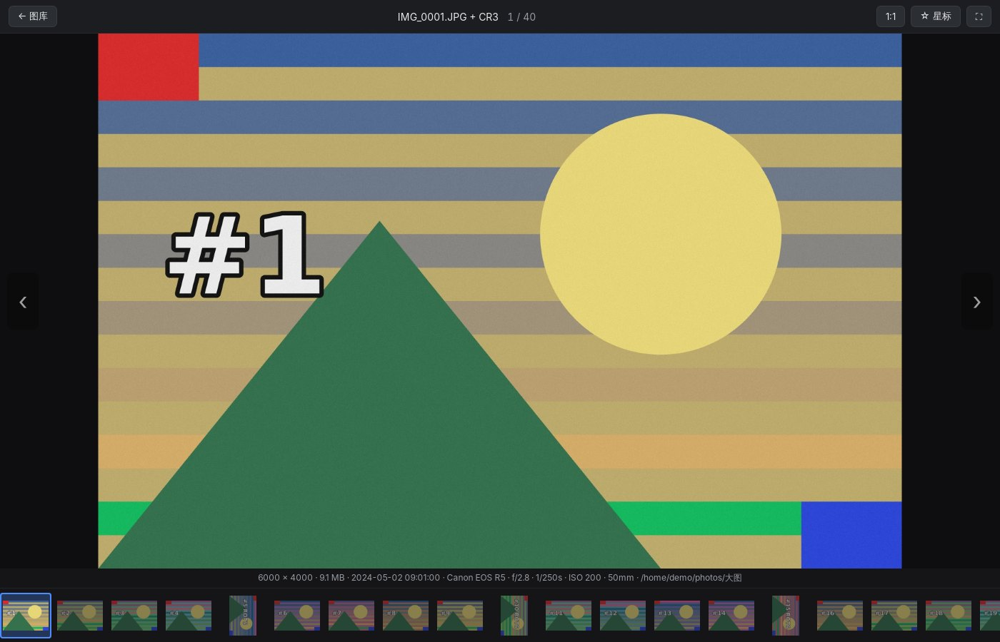
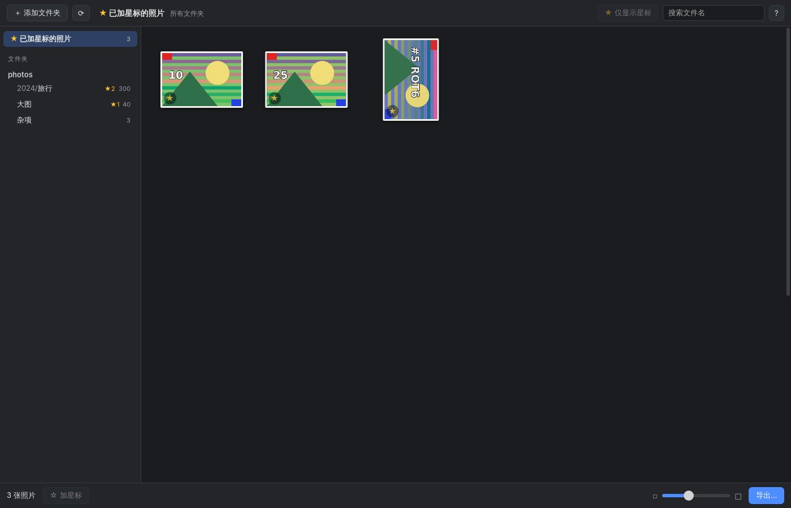
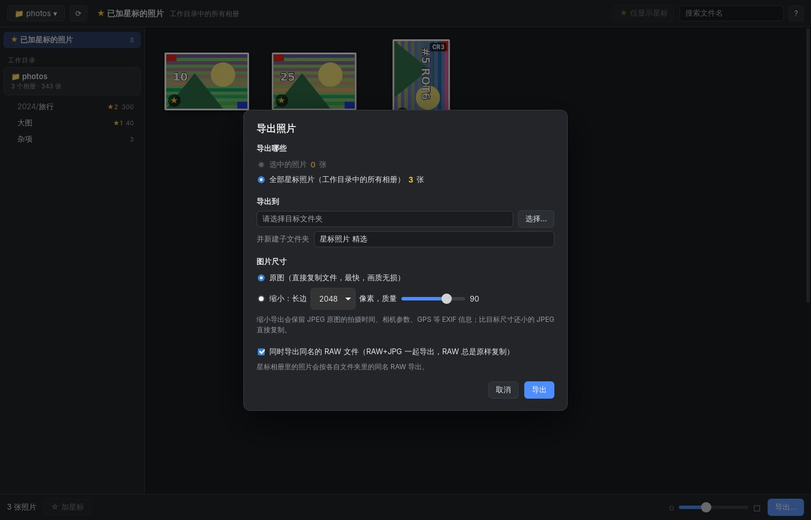

# 选片 PhotoPicker

仿 **Picasa 3** 的 macOS 选片工具。Picasa 停更多年、Mac 上早已装不了，这里把它最好用的那一套
“看图 → 打星 → 筛出星标 → 导出”重新做了一遍，并且把**滚轮翻图不卡**当成第一目标。

| 图库网格 | 看大图（滚轮翻页 + 底部胶片条） |
|---|---|
|  |  |
| **已加星标的照片**（汇总所有文件夹） | **导出**（原图 / 缩小，保留 EXIF） |
|  |  |

（截图里是自动生成的测试图片）

## 功能（v0.2：先把选片这条线做好）

| 功能 | 说明 |
|---|---|
| 工作目录 | 选一个**工作目录**（⌘O，或把文件夹拖进窗口），自动扫描它下面所有含照片的子文件夹作为**相册**，侧栏像 Picasa 一样平铺；记住最近用过的工作目录，一键切换 |
| 缩略图网格 | 上万张也流畅；滑块 / 触控板捏合调大小；单击、⌘ 点击、Shift 点击、Shift+方向键多选 |
| 看大图 | 双击 / 回车进入；**滚轮一格一张**，触控板轻扫一张；底部胶片条；显示尺寸、拍摄时间、相机、光圈快门 ISO |
| 放大查看 | 按 `1` 或双击切到 1:1 实际像素（看对焦），捏合 / ⌘+滚轮缩放，拖动平移 |
| 星标 | **空格**加 / 取消（`S`、Picasa 的 `⌘8` 也行）；多选时“有没加星的就全部加星” |
| RAW+JPG | 像 Lightroom 一样：同名的 `IMG_0001.JPG` + `IMG_0001.CR3` 合成**一张**，只预览 JPG（快），角标显示 `CR3`；打星时两个文件一起打，**导出时两个格式一起导出** |
| 筛选 | “仅显示星标”开关（`Shift+S`）；侧栏“已加星标的照片”汇总工作目录里所有相册的星标；按文件名搜索 |
| 导出 | 星标 / 选中 / 全部星标 → 目标文件夹（可自动建子文件夹）；**原图复制**或**缩小导出**（保留 EXIF） |
| Picasa 兼容 | 星标读写 Picasa 的 `.picasa.ini`，Windows 上 Picasa 打过的星直接能看到 |
| 格式 | JPEG、PNG、WebP、GIF、BMP、TIFF；macOS 上还有 **HEIC / AVIF / 各家 RAW**（CR2/CR3/NEF/ARW/DNG/RAF/ORF/RW2…） |

快捷键在 App 里按 `?` 随时查看。

## 安装

### 直接下载（推荐）

仓库的 GitHub Actions 每次推送到 `main` 都会在 Mac 上打一个**通用版 dmg**（Apple 芯片和 Intel 都能用）：
Actions → 最新一次 `build` → 页面底部 Artifacts → `PhotoPicker-macOS`。打 `v*` tag 时还会自动发布到 Releases。

App 没有经过苹果公证（要付费开发者账号），第一次打开会提示“无法验证开发者”。两种办法任选：

- 在“应用程序”里**右键 → 打开 → 打开**（只需一次）；
- 或者终端执行：`xattr -dr com.apple.quarantine /Applications/PhotoPicker.app`

### 自己编译

```bash
# 需要 Node 20+ 和 Rust（https://rustup.rs）
npm install
npm run tauri dev          # 开发模式
npm run tauri build        # 打包，产物在 src-tauri/target/release/bundle/
```

## 星标存在哪里？

和 Picasa 3 完全一样：存在**照片所在文件夹**的隐藏文件 `.picasa.ini` 里。例如给 `IMG_0001.JPG` 加星后：

```ini
[IMG_0001.JPG]
star=yes
```

这样做的好处：

- **和 Picasa 互通**：以前在 Windows 上用 Picasa 打的星，文件夹拷到 Mac 上直接能看到，反过来也一样；
- **星标跟着照片走**：整个文件夹移动、拷贝、备份到移动硬盘，星标都还在，不依赖某个数据库；
- **只改 `star=` 这一行**：Picasa 写的人脸、旋转等其它信息原样保留，换行风格（Windows 的 CRLF）也不变。

如果文件夹不可写（只读 U 盘、网络盘），星标会自动改存到 App 自己的数据目录，并给出提示。

RAW+JPG 的照片，星标会同时写在两个文件名上（`[IMG_0001.JPG]` 和 `[IMG_0001.CR3]` 都是 `star=yes`），
这样在 Picasa 或其它认 `.picasa.ini` 的软件里看，两个文件的状态也一致；读的时候任意一个有星就算这张有星。

## RAW+JPG 是怎么配对的？

相机设成“RAW+JPEG”时，每按一次快门会存两个文件：`IMG_0001.CR3`（RAW，几十 MB，保留全部信息，后期用）
和 `IMG_0001.JPG`（相机直出，小、解码快）。选片阶段只需要看 JPG 就能判断好坏，但选中的照片最后要连 RAW 一起拿去修。

规则（与 Lightroom 的“把 JPEG 当作 RAW 的附属文件”相同，只是反过来显示 JPG）：

- 同一文件夹里，**去掉扩展名后同名**（不分大小写）的文件归为一组；
- 组里有 JPG → 显示 JPG，RAW 和 Lightroom/Capture One 的 `.xmp` 侧车文件（`IMG_0001.xmp` 或 `IMG_0001.CR3.xmp`）跟着它；
- 只有 RAW、没有 JPG → macOS 上单独显示 RAW（系统能解），其它平台解不了就不显示；
- 同名的两个可显示格式（比如 `a.HEIC` 和 `a.JPG`）不合并，各算一张。

导出时默认勾选“同时导出同名的 RAW 文件”：JPG 按你选的方式导出（原图或缩小），RAW 总是原样复制；
重名需要改名时整组一起改（`IMG_0001 (1).JPG` + `IMG_0001 (1).CR3`），导出后依然配对。

## 为什么滚轮翻图不卡？（原理）

看图软件“卡”，九成是卡在**解码**上。打个比方：一张 2400 万像素的 JPEG 文件只有 10MB，
但要显示它，得先“解压”成 6000×4000 个像素点、约 96MB 的位图——这一步在普通电脑上要几十到上百毫秒。
如果每滚一格都现场解压一张，就会一顿一顿的。下面几招都是围绕“别让用户等解码”展开的。

### 1. 先糊后清

翻到一张照片时，**立刻**把它的缩略图（400px，早就缓存好了）拉大铺满屏幕，同时在后台准备清晰版，
准备好了再无缝替换。眼睛看到的是“瞬间切过去、随即变清晰”，而不是“卡住、然后突然出现”。
这正是 Picasa 当年的做法。

### 2. 预加载：你还没翻到，它已经解好了

当前这张显示出来后，马上按你翻页的**方向**，在后台提前加载并解码后面 2 张、前面 1 张
（用浏览器的 `img.decode()`，在后台线程解码，不占界面线程）。解好的图片元素放在一个小缓存里，
翻到它时直接插进页面——**不需要再解码**。

实测（4 核 Linux 虚拟机、纯软件解码、2400 万像素 / 9.6MB 的 JPEG）：

| 场景 | 结果 |
|---|---|
| 正常节奏滚轮翻页（每格间隔 0.4 秒） | 8 张全部命中预加载，**滚轮一动到清晰图显示 3~4 毫秒** |
| 0.4 秒内猛滚 10 格 | 10 格一格不丢；途中显示缩略图，**停下后约 0.35 秒出清晰图** |

macOS 上解码走系统 ImageIO（Apple 芯片有硬件 JPEG/HEIC 解码），会比这个虚拟机快得多。

### 3. 只解码屏幕需要的像素

你的屏幕（哪怕是 5K）也显示不了 6000×4000。所以看图时请求的不是原图，而是**缩到屏幕物理像素大小**的版本：
后端用 JPEG 的“DCT 域缩放”在解压阶段就直接解出 1/2、1/4 尺寸（JPEG 是按 8×8 小块压缩的，
解压时可以每块只还原 4×4 或 2×2 个点），计算量和内存都成倍下降。

举个例子：6000px 宽的照片要在 1400px 宽的窗口里显示。如果严格要求“至少 1600px”，只能选 1/2 档解出 3000px
再缩小到 1600px；而允许略小一点，直接选 1/4 档解出 1500px——已经比窗口还宽，省掉了缩放这一步。
实测这一改动让预览生成从 408ms 降到 235ms（这个“略小”只用于屏幕显示，导出时尺寸严格按你选的来）。
macOS 上这一步交给系统的 ImageIO 框架，它在 Apple 芯片上还有硬件解码，HEIC、RAW 也一并支持。
只有当你按 `1` 放大到 1:1 看对焦时，才去加载原图。

### 4. 快速翻页时“只看缩略图”

按住方向键或猛滚滚轮时，路过的照片只显示缩略图，不去请求清晰版；停下 90 毫秒才加载。
否则后端会被一大堆“马上就离开”的请求塞满，等你停下时反而要排队。

### 5. 滚轮和触控板分开处理

鼠标滚轮“咔哒”一格是一个事件，触控板轻轻一划却是几十个小事件，手指离开后还有一串逐渐变小的**惯性**事件。
如果按事件数翻页，触控板一划就飞过去二三十张。`src/wheel.ts` 会识别：

- 手势的**第一下立即翻页**（零延迟）；
- 鼠标滚轮：一格一张，快速连滚也一格不丢；
- 触控板：累计滑动距离才翻页，并识别出“惯性滑行”（delta 持续变小）不再翻页——轻扫一下就是一张。

### 6. 缩略图：磁盘缓存 + 有优先级的后台线程

- 缩略图生成一次后存在 `~/Library/Caches/io.github.czt6666.photopicker/thumbs/`，以后打开文件夹直接读，毫秒级；
  缓存键包含文件大小和修改时间，照片被修改后自动重新生成。
- 打开文件夹时，后台按顺序把整个文件夹的缩略图预先生成好（状态栏显示进度）。
- 网格里**看得见的**缩略图插队优先；而且用“后进先出”：你飞快地往下滚时，最后滚进视野的那一屏最先出图，
  不会出现“滚到底了还在一张张生成顶部早就看不见的图”。

### 7. 网格虚拟化

一个文件夹上万张照片，如果真建一万个 ``，页面自己就卡死了。网格只创建“视口内 + 上下几行”的格子
（通常几十个），滚动时把滚出去的格子挪到新位置、换上新图片。

### 8. 为什么选 Tauri（Rust + 系统 WebView）

- 界面用系统自带的 WebKit（就是 Safari 的内核），安装包只有几 MB，内存占用远小于 Electron；
  它原生支持 HEIC、能用 GPU 合成；
- 重活（扫描、解码、缩放、导出）在 Rust 里多线程跑，调用 macOS ImageIO；
- 图片字节不走 IPC（那要先转成 JSON/base64，又大又慢），而是通过自定义协议 `thumb://`、`photo://` 直接喂给 ``。

## 导出

- **原图**：直接复制文件。在 APFS 磁盘上会走“写时复制克隆”，几十 GB 也是一瞬间、不占额外空间；保留修改时间。
- **缩小**：长边缩到指定像素（1280～3840）、指定 JPEG 质量；**保留 EXIF**（拍摄时间、GPS、相机参数）和 ICC 色彩配置，
  方向标记重置（像素已经转正了）。比目标尺寸还小的 JPEG 直接复制，避免二次压缩。
- **RAW+JPG**：默认把同名的 RAW（和 .xmp）一起导出，RAW 原样复制。
- 重名自动改成 `名字 (1).jpg`（成组的文件一起改名），**从不覆盖**已有文件。

## 目录结构

```
src/                 前端（TypeScript，无框架，直接操作 DOM）
  main.ts            入口：组装各部分、全局快捷键
  grid.ts            虚拟化缩略图网格、多选
  viewer.ts          看大图：先糊后清、预加载、缩放平移、胶片条
  loader.ts          图片预加载 + 已解码图片 LRU 缓存
  wheel.ts           滚轮 / 触控板手势 → 翻页
  exportDialog.ts    导出对话框
  sidebar.ts store.ts api.ts ui.ts styles.css
src-tauri/src/       后端（Rust）
  lib.rs             IPC 命令、thumb:// photo:// 协议、应用状态
  images.rs          缩略图（磁盘缓存）、屏幕尺寸预览（内存缓存）
  pool.rs            带优先级（插队 / 后进先出 / 后台）的图片处理线程池
  decode.rs          解码 + DCT 缩放 + EXIF 转正 + 编码 JPEG
  macos.rs           macOS ImageIO 解码（HEIC / RAW / 硬件加速）
  picasa_ini.rs      .picasa.ini 读写（保留原有内容）
  stars.rs           星标存储（文件夹不可写时的兜底）
  scan.rs            扫描工作目录、列出相册、RAW+JPG 配对
  export.rs meta.rs formats.rs natural.rs
tests/unit/          前端单测（vitest）
tests/e2e/           端到端测试：在 Linux 上驱动真实 App（Xvfb + tauri-driver）
scripts/             生成图标、生成测试照片
```

## 测试

```bash
npm test                              # 前端单测（滚轮手势识别等）
cd src-tauri && cargo test            # 后端单测（.picasa.ini、线程池、解码转正、导出、协议安全…）

# 端到端（Linux）：生成测试照片 → 编译 → 用真实鼠标滚轮事件驱动 App
python3 scripts/make_test_photos.py /tmp/pp-e2e/photos 40 300
npx tauri build --debug --no-bundle
python3 tests/e2e/run_e2e.py /tmp/pp-e2e
```

解码性能基准（手动跑）：

```bash
cd src-tauri && PP_BENCH_FILE=/path/to/big.jpg cargo test --release bench_render -- --ignored --nocapture
```

端到端测试（42 项）覆盖：工作目录（切换、重启后记住、最近列表）、读取已有 Picasa 星标、虚拟化网格、仅显示星标、
空格 / 多选打星并写回 `.picasa.ini`、RAW+JPG 合并显示与成对打星 / 导出、滚轮一格一张、预加载命中率、EXIF 竖拍转正、
1:1 加载原图、星标相册、缩小导出保留 EXIF、原图导出字节一致、协议拒绝访问工作目录以外的文件。

## 已知限制 / 下一步

- [ ] 按拍摄日期排序（目前按文件名自然排序，相机文件名本身就是按时间递增的）
- [ ] 删除 / 移到“废片”文件夹
- [ ] 无损旋转（写 Picasa 的 `rotate=` 字段）
- [ ] 监听文件夹变化自动刷新（目前点工具栏的 ⟳ 重新扫描）
- HEIC / RAW 只在 macOS 上支持（靠系统 ImageIO）；缩小导出时只有 JPEG 原图能保留 EXIF
- 未经苹果公证，首次打开需右键 → 打开
